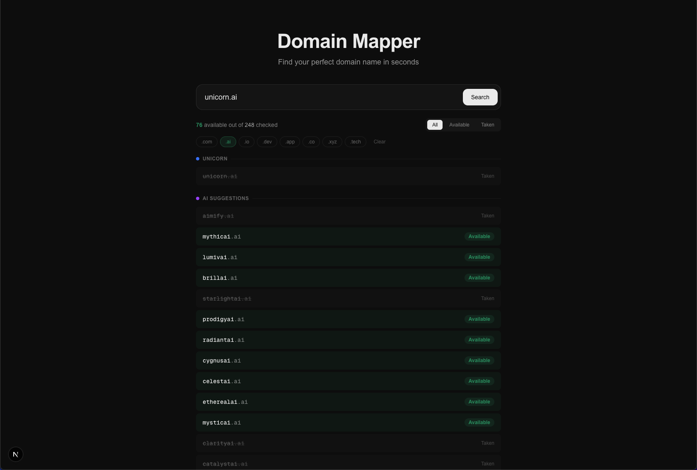

# Domain Mapper

AI-powered domain name generator and availability checker. Find your perfect domain name in seconds.



## What It Does

Type a domain name like `aiunicorn.com` and Domain Mapper will:

1. **Check exact availability** -- instantly checks your domain across 8 TLDs (`.com`, `.ai`, `.io`, `.dev`, `.app`, `.co`, `.xyz`, `.tech`)
2. **Generate smart alternatives** -- uses Google Gemini AI to suggest brandable domain names that capture the same intent as your search
3. **Show results in real-time** -- exact matches appear first (fast DNS), AI suggestions stream in after

The AI doesn't just append "get" or "hub" to your word. It thinks like a branding strategist -- understanding *why* you want a domain and suggesting names someone would actually pick as their company name (portmanteaus, phonetic plays, metaphors, invented words).

## Architecture

```
┌─────────────────────────────────────────────────────┐
│                     Frontend                         │
│              Next.js + Tailwind CSS                  │
│                                                      │
│  ┌──────────┐  ┌──────────────┐  ┌───────────────┐  │
│  │  Search   │  │  TLD Filter  │  │ Status Filter │  │
│  │  Input    │  │  .com .ai .. │  │ All/Avail/Tkn │  │
│  └────┬─────┘  └──────────────┘  └───────────────┘  │
│       │                                              │
│       ▼                                              │
│  ┌─────────────────────────────────────────────┐     │
│  │         Streaming Results Display            │     │
│  │  Phase 1: Exact Match (skeleton → results)   │     │
│  │  Phase 2: AI Suggestions (skeleton → results)│     │
│  └─────────────────────────────────────────────┘     │
└──────────────────────┬──────────────────────────────┘
                       │ POST /api/search (streamed NDJSON)
                       ▼
┌─────────────────────────────────────────────────────┐
│                   API Route                          │
│            src/app/api/search/route.ts               │
│                                                      │
│  1. Parse input ("AI unicorn.com" → "aiunicorn")    │
│  2. Stream Phase 1: Exact domain check              │
│  3. Stream Phase 2: AI suggestions + check          │
│                                                      │
│  ┌─────────────┐  ┌──────────────┐  ┌────────────┐ │
│  │   Input      │  │   Gemini AI  │  │   DNS      │ │
│  │   Parser     │  │   Name Gen   │  │   Checker  │ │
│  └─────────────┘  └──────────────┘  └────────────┘ │
│                                                      │
│  ┌──────────────────────────────────────────────┐   │
│  │            In-Memory Cache (24h TTL)          │   │
│  └──────────────────────────────────────────────┘   │
└─────────────────────────────────────────────────────┘
```

### Request Flow

```
User types "aiunicorn.com" → hits Search
  │
  ├─ Phase 1 (instant): Parse → DNS check aiunicorn across 8 TLDs → stream results
  │
  └─ Phase 2 (~1-2s): Gemini generates 30 brandable names
                        → expand each across 8 TLDs (240 domains)
                        → parallel DNS check all
                        → sort by .com availability
                        → stream results
```

### Key Files

```
src/
├── app/
│   ├── api/search/route.ts    ← Streaming API endpoint
│   ├── layout.tsx
│   ├── page.tsx
│   └── globals.css
├── components/
│   └── domain-search.tsx      ← Client UI with streaming + filters
└── lib/
    ├── name-generator.ts      ← Input parser + TLD expansion
    ├── gemini.ts              ← AI name generation (Gemini 2.0 Flash)
    └── domain-checker.ts      ← Parallel DNS availability checker
```

## Performance

- **Parallel DNS** -- hundreds of domains checked simultaneously via `Promise.all`
- **Streaming response** -- exact matches appear in ~200ms, AI suggestions follow
- **24h in-memory cache** -- repeat searches are instant
- **Request abort** -- new search cancels previous in-flight request
- **Skeleton loading** -- pulsing placeholders keep users engaged

## Setup

```bash
# Clone
git clone <repo-url>
cd domain-mapper

# Install
npm install

# Configure
cp .env.example .env.local
# Edit .env.local and add your Gemini API key

# Run
npm run dev
```

Open [http://localhost:3000](http://localhost:3000).

## Environment Variables

| Variable | Description |
|----------|-------------|
| `GEMINI_API_KEY` | Google Gemini API key ([Get one here](https://aistudio.google.com/apikey)) |

## Tech Stack

- **Framework**: Next.js 16 (App Router)
- **Styling**: Tailwind CSS 4
- **AI**: Google Gemini 2.0 Flash
- **Domain Check**: Node.js `dns/promises` (parallel resolution)
- **Language**: TypeScript
```markdown
## Credits

Built by [mrx-arafat](https://github.com/mrx-arafat).

**GitHub Repository**: [mrx-arafat/domain-mapper](https://github.com/mrx-arafat/domain-mapper)
```
